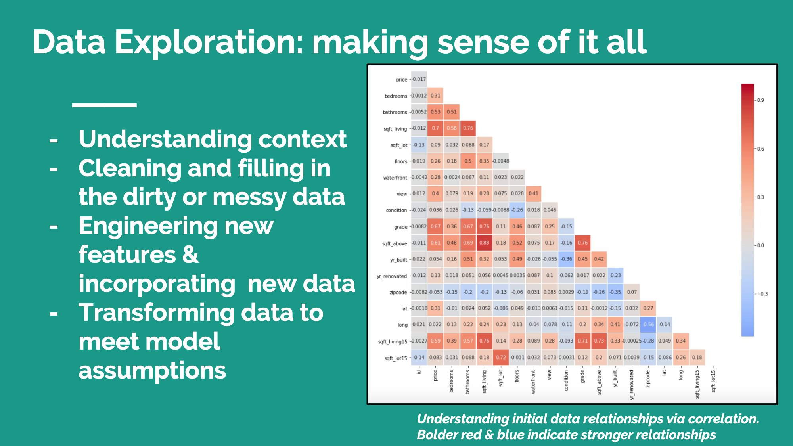
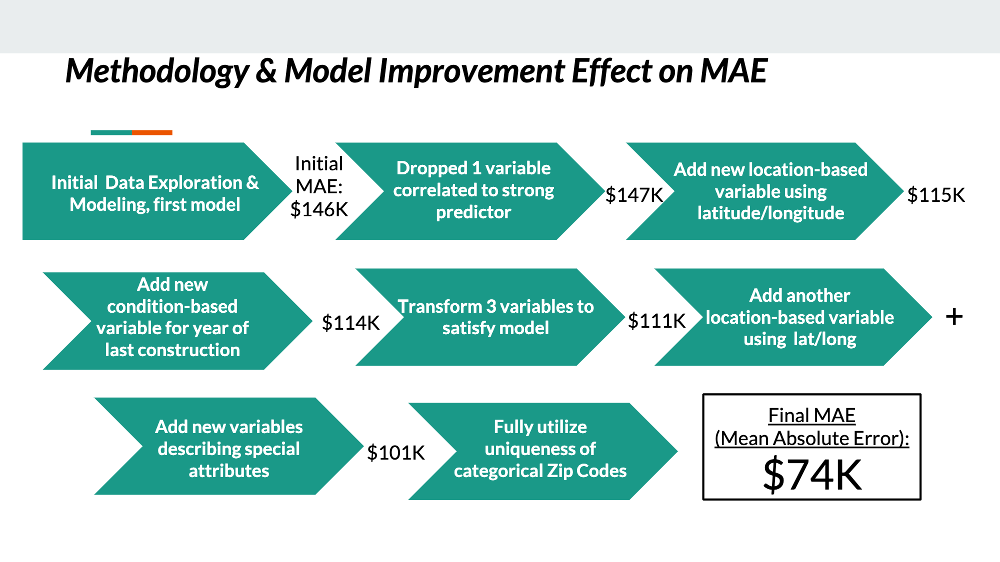

# King County, WA Home Price Predictor
## Alex Shropshire & Kevin Velasco

**Blog Post:** 
https://medium.com/@as6140/transforming-categorical-data-for-usability-in-machine-learning-predictions-90459c3fc967

**Presentation PDF** 
https://github.com/as6140/kingcountyWA_home_price_predictor/blob/master/velasco_shropshire_mod1_presentation.pdf

## Relevance & Goals
To clean, explore, and model this dataset with a multivariate linear regression to predict the sale price of houses as accurately as possible given historical sales data. This sort of model could be utilized as a predictor for Real Estate Agents, Investors, Technology Companies, Researchers, and other stakeholders to take advantage of opportunities to buy, sell, renovate, or analyze unique real estate features and their effect on market price.

## Understanding the Data
2014 - 2015 King County, Washington House Sales dataset with over 20K transactions describing 19 unique features about the transaction, the building, the property, and the location. The dataset can be found in the file `"kc_house_data.csv"`, in this repo. The detailed description of the column names can be found in the 'column_names.md' file in this repository. 

## Exploring & Preparing the Data

  

**Rough Early Exploratory Analysis**: WIP_notebook.ipynb

**Location-based Feature Engineering Notebook**: location_engineering.ipynb

**Mid-Project datasets with cleaning & additional features**:
house_data_cleaned.csv
house_data_cleaned_for_test5.csv
house_data_cleaned_for_test6.csv
last_test.csv
seattle_zips.csv

## Modeling

  

**Rough Model Improvement notebook**: model_improvement.ipynb

**Comprehensive Clean Notebook**: final_notebook_mod1.ipynb

## Key Insights
Location based factors such as Zip Code and Distance from Economic Hubs contributed most to higher prices in our multiple linear regression models. Other key contributors were attributes about the size of the property and the number of beds and baths. Special attributes like year of last construction and the presence of waterfront views also contributed to our models incrementally improved Mean Absolute Error. Future work might have us re-model with large, expensive outliers removed and might incorporate more years of data over more locations. That said, our Final MAE was $74K. We can be quite confident in our predictor to be reasonably spot on! 

